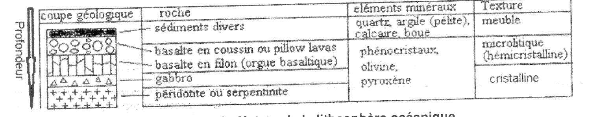
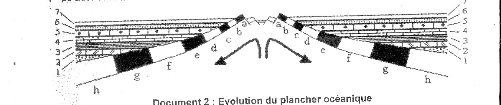
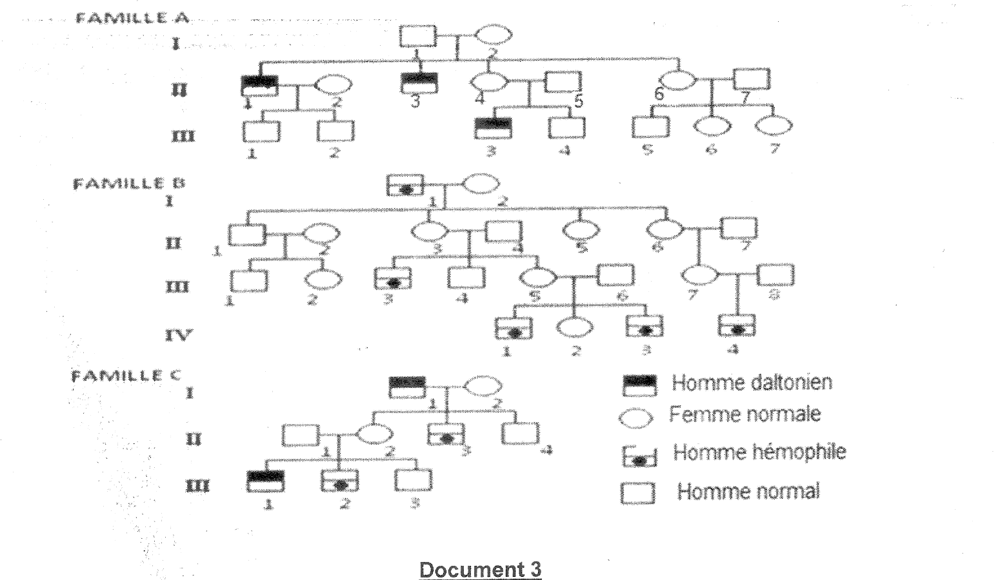
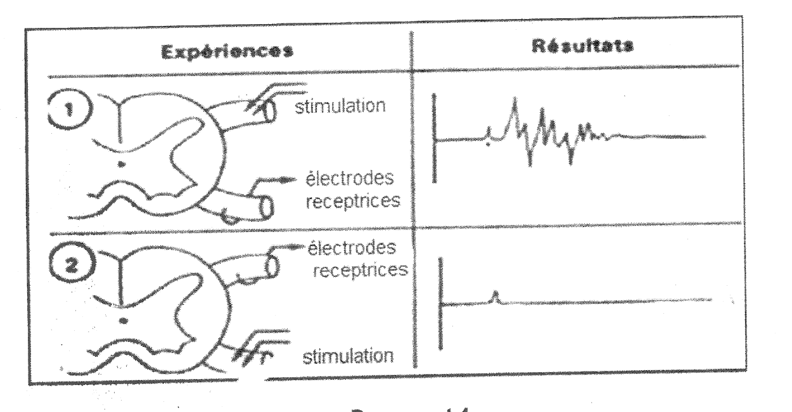
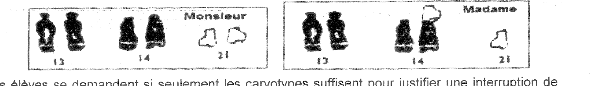

Matière :        SVT (SVTEEHB)
Niveau / Série : Terminale D
Examen visé :    BAC/ESG
Durée épreuve :  4 heures
Coefficient :    4
Année :          2021
Note éliminatoire : < 04/20

---

# Exercice 1 - QCM (Partie A, /4 pts)

### Rappel de méthode
Dans un QCM scientifique, chaque proposition fausse l'est pour une raison précise (contresens, confusion de mécanisme, absolu non vérifié comme "toujours" ou "jamais"). La bonne méthode consiste à justifier pourquoi les trois distracteurs sont faux avant de valider la proposition retenue, plutôt que de reconnaître la bonne réponse "à l'instinct".

**1. La GnRH**

a- Fausse : la GnRH n'est pas conduite par des axones jusqu'à l'antéhypophyse ; elle est déversée dans le sang du système porte hypothalamo-hypophysaire, une voie sanguine et non nerveuse.
b- Vraie : la GnRH (Gonadotropin-Releasing Hormone) est synthétisée par des neurones neurosécréteurs de l'hypothalamus.
c- Fausse : la GnRH stimule l'antéhypophyse, qui sécrète LH et FSH agissant à la fois sur les testicules et sur les ovaires.
d- Fausse : la GnRH n'agit pas directement sur les gamètes ; elle agit sur l'antéhypophyse, qui elle-même agit sur les gonades.

**Réponse : b**

**2. Le potentiel d'action**

a- Fausse : le potentiel d'action obéit à la loi du tout ou rien, son amplitude reste constante le long de la fibre, elle ne décroît pas.
b- Vraie : le potentiel d'action correspond à des mouvements ioniques (entrée de Na⁺ puis sortie de K⁺) intenses et brefs à travers la membrane excitée.
c- Fausse : sa durée se compte en millisecondes, pas en "milliers de secondes".
d- Fausse : dans un nerf, la propagation est fonctionnellement unidirectionnelle (du récepteur vers le centre nerveux) à cause des synapses ; "toujours de part et d'autre" est un abus de langage.

**Réponse : b**

**3. L'évolution de l'Homme**

a- Fausse : l'Homme et le chimpanzé partagent au contraire un très fort pourcentage de gènes communs (de l'ordre de 98 à 99 %).
b- Fausse : l'Australopithèque appartient déjà à la lignée humaine ; il n'est pas le dernier ancêtre commun Homme-chimpanzé, lequel est bien plus ancien et non hominidé.
c- Fausse : les critères d'appartenance à la lignée humaine sont morphologiques ET moléculaires (comparaison de l'ADN, des protéines).
d- Vraie par élimination : la différence de nombre de chromosomes (46 chez l'Homme contre 48 chez le chimpanzé) résulte d'un événement de fusion chromosomique entre deux chromosomes ancestraux (à l'origine du chromosome 2 humain).

**Réponse : d**

### Piège à éviter
Ne confonds pas "fusion chromosomique" (un seul événement, à l'origine du chromosome 2 humain) avec "de nombreuses translocations" : la formulation de la proposition d est scientifiquement imprécise, mais elle reste la seule des quatre compatible avec les faits une fois a, b et c éliminées. Dans un QCM, une proposition retenue par élimination doit quand même être justifiée sur le fond, pas seulement par défaut.

**4. Les mécanismes de l'immunité**

a- Fausse : une molécule d'anticorps comporte quatre chaînes polypeptidiques (deux chaînes lourdes et deux chaînes légères identiques deux à deux), pas seulement deux.
b- Fausse : le lymphocyte T ne reconnaît pas un antigène isolé ; il ne reconnaît un antigène que présenté par une molécule du CMH à la surface d'une cellule présentatrice.
c- Fausse : le complexe immun ne précipite pas systématiquement ; la précipitation dépend des proportions relatives anticorps/antigène.
d- Vraie : les anticorps fixés sur les antigènes de paroi bactérienne opsonisent la bactérie, ce qui facilite sa reconnaissance et sa phagocytose par les phagocytes.

**Réponse : d**

### Conseil
Sur un QCM, élimine d'abord les propositions qui contiennent un mot absolu ("toujours", "jamais", "uniquement", "directement") : elles sont statistiquement les plus souvent fausses en sciences, où les mécanismes ont presque toujours des nuances ou des exceptions.

---

# Exercice 2 - Exploitation de documents : lithosphère océanique (Partie A, /4 pts)

### Rappel de méthode
La lithosphère océanique se forme par cristallisation d'un même magma basaltique à différentes profondeurs sous l'axe de la dorsale. La texture d'une roche magmatique dépend de la vitesse de refroidissement du magma : refroidissement rapide (contact avec l'eau de mer, faible profondeur) donne une texture microlitique voire vitreuse ; refroidissement lent (grande profondeur, isolation thermique) donne une texture entièrement cristalline (grenue).

**1. Composition chimique identique des basaltes, gabbro et serpentinites (0,5 pt)**

Ces trois roches dérivent toutes du même magma basaltique, issu de la fusion partielle de la péridotite du manteau au niveau de l'axe de la dorsale. Qu'elles cristallisent en surface (basalte), en profondeur intermédiaire (gabbro) ou qu'elles résultent de l'hydratation de la péridotite mantellique (serpentinite), leur origine magmatique commune leur confère la même composition chimique globale (mêmes éléments majeurs : silice, fer, magnésium) et les mêmes minéraux essentiels (olivine, pyroxène).

**2. Différence de texture (0,5 pt)**

La texture dépend uniquement de la vitesse de refroidissement, donc de la profondeur de cristallisation :
- le basalte (coussin, filon), au contact de l'eau de mer, refroidit vite → texture microlitique (hémicristalline) : de petits cristaux (microlites) noyés dans du verre non cristallisé ;
- le gabbro, cristallisant lentement en profondeur, a le temps de développer des cristaux jointifs de grande taille → texture entièrement cristalline (grenue).

**3. Sondages sous-marins - datation absolue**

Tableau : Distance (km) : 250, 400, 470, 650, 750, 1000, 1300 - Âge (Ma) : 11, 24, 26, 34, 41, 50, 68.

a) Construction du graphe (1 pt) : en abscisse, la distance à l'axe (échelle 1 cm pour 100 km) ; en ordonnée, l'âge (échelle 1 cm pour 10 Ma). Placer les 7 points (250 ; 11), (400 ; 24), (470 ; 26), (650 ; 34), (750 ; 41), (1000 ; 50), (1300 ; 68), puis tracer la droite moyenne passant approximativement par l'origine (0 ; 0) et ajustant au mieux le nuage de points.

b) Analyse du graphe (0,5 pt) : les points sont sensiblement alignés sur une droite passant par l'origine. L'âge du plancher océanique est donc proportionnel à sa distance à l'axe de la dorsale : plus on s'éloigne de l'axe, plus le plancher océanique est ancien, et cet accroissement est régulier (linéaire), pas aléatoire.

### Piège à éviter
Ne trace jamais une courbe qui "passe par tous les points" en zigzag : les mesures de terrain comportent une marge d'erreur, la droite doit être la meilleure droite moyenne, pas une ligne brisée reliant chaque point.

### Conseil
Calcule le rapport âge/distance pour deux ou trois couples de valeurs avant de tracer (ici environ 0,05 Ma/km pour chaque couple) : si ce rapport est à peu près constant, tu as la confirmation numérique que la relation est linéaire avant même de tracer le graphe, et tu limites le risque d'erreur de construction.

**4. Document 2 : modèle du plancher océanique**

a) Classement des strates 1 à 7, de la plus ancienne à la plus récente (0,5 pt) : les strates profondes (1, à la base : péridotite/gabbro) se mettent en place au niveau de l'axe de la dorsale et ne sont plus modifiées après leur formation, tandis que les sédiments (strate 7, au sommet) continuent de s'accumuler en continu tant que le plancher existe. L'ordre de la plus ancienne à la plus récente est donc : 1 → 2 → 3 → 4 → 5 → 6 → 7 (de la base vers le sommet).

b) Âge relatif des basaltes a et h (0,5 pt) : le basalte a, situé près de l'axe de la dorsale, est plus récent (plus jeune) ; le basalte h, situé loin de l'axe, à l'extrémité du profil, est plus ancien (plus âgé).

c) Conclusion sur l'âge relatif des basaltes par rapport à l'axe de la dorsale (0,5 pt) : plus un basalte est éloigné de l'axe de la dorsale, plus il est ancien. Cette conclusion, tirée du document 2, est cohérente avec le résultat de la question 3 : elle confirme que le plancher océanique s'écarte progressivement de l'axe de la dorsale au cours du temps (expansion océanique), chaque nouvelle portion de plancher se formant à l'axe avant d'être repoussée latéralement par la formation de plancher plus jeune derrière elle.

### Conseil
Le document 1 (nature des roches) et le document 2 (position des basaltes a à h) répondent en réalité à la même question sous deux angles différents (composition/texture d'un côté, position spatiale de l'autre) : relie toujours explicitement les deux documents dans ta conclusion finale, c'est ce qui distingue une copie qui "traite les questions" d'une copie qui "construit un raisonnement".

---

# Exercice 1 (Partie B) - Pédigrees : daltonisme et hémophilie (/6 pts)

### Rappel de méthode
Pour déterminer le mode de transmission d'une anomalie à partir d'un arbre généalogique, deux questions se posent dans l'ordre : l'allèle responsable est-il dominant ou récessif (des parents non atteints peuvent-ils avoir un enfant atteint ?) ; le gène est-il porté par un autosome ou par le chromosome X (l'anomalie touche-t-elle les deux sexes de façon égale, ou presque uniquement les hommes, avec une transmission caractéristique mère porteuse → fils atteint ?).

**1. Mode de transmission des deux anomalies (1 pt)**

a) Dominant ou récessif : dans les trois familles, des parents phénotypiquement normaux (ex. I₁ × I₂ dans la famille A, II₃ × II₄ dans la famille B) ont des enfants atteints (II₁, II₃ dans la famille A ; III₃ dans la famille B). Un caractère porté par un allèle dominant s'exprimerait chez au moins un des deux parents s'il était transmis à l'enfant ; ici les parents sont indemnes. Les deux anomalies sont donc **récessives**.

b) Autosomique ou gonosomique : sur l'ensemble des trois familles, tous les individus atteints (daltonisme et hémophilie confondus) sont des hommes ; aucune femme atteinte n'apparaît, alors que les femmes sont nombreuses dans les pédigrees et auraient dû être touchées avec une fréquence comparable si le gène était porté par un autosome. Les deux anomalies sont donc **gonosomiques, portées par le chromosome X** (le chromosome Y, très court, ne porte pas ces gènes).

### Piège à éviter
Ne conclus jamais "récessif autosomique" seulement parce que les parents sont sains : ce constat prouve la récessivité, pas la localisation chromosomique. La localisation gonosomique se démontre par un argument séparé, portant sur la répartition par sexe des individus atteints.

**2. Génotypes**

On note X^D et X^d les allèles (D : normal, dominant ; d : daltonisme, récessif) et X^H, X^h pour l'hémophilie (H : normal, dominant ; h : hémophilie, récessive).

a) Famille A - II₄ et III₃ (1 pt)

II₄ est fille de I₁ (X^D Y, normal) et I₂. Comme les fils I₁-I₂ (II₁ et II₃) sont daltoniens (X^d Y), I₂ leur a transmis un X^d : I₂ est donc hétérozygote X^D X^d. II₄ reçoit un X^D de son père (I₁ n'a qu'un X^D à transmettre à ses filles) et un X^D ou un X^d de sa mère. Or II₄, mariée à II₅ (normal, X^D Y), a un fils III₃ atteint (X^d Y) : ce fils n'a pu recevoir son X^d que de sa mère. II₄ est donc obligatoirement porteuse : **II₄ = X^D X^d**.

III₃ est un fils atteint de daltonisme : **III₃ = X^d Y**.

b) Famille B - II₃ et IV₁ (1 pt)

II₃ est fille de I₁ (hémophile, X^h Y) et I₂ (normale). Toute fille d'un père hémophile reçoit obligatoirement l'X^h paternel (le père ne transmet que son X à ses filles) : **II₃ = X^H X^h** (hétérozygote, porteuse saine), qu'elle soit ou non confirmée par un fils atteint - ici elle l'est, puisque son fils III₃ est hémophile.

IV₁ est un individu atteint d'hémophilie : **IV₁ = X^h Y**.

c) Famille C - II₁ et II₂ (1 pt)

Dans la famille C coexistent les deux anomalies. I₁ est daltonien (X^(d,H) Y) et I₂ est normale. Leurs enfants sont II₂ (fille, normale) et II₃ (fils, hémophile mais non daltonien) : pour que II₃ soit hémophile sans être daltonien, il doit avoir reçu de sa mère un X^(D,h) ; I₂ est donc doublement informative : **I₂ = X^(D,H) / X^(D,h)**, porteuse de l'hémophilie uniquement.

II₁ (mari de II₂, marié dans la famille, phénotypiquement normal pour les deux caractères) : **II₁ = X^(D,H) Y**.

II₂ (fille de I₁ × I₂) reçoit de son père I₁ l'X^(d,H) et de sa mère I₂ soit X^(D,H) soit X^(D,h). Son fils III₂ est hémophile (X^(D,h) Y si l'on suit la même logique que ci-dessus) et son fils III₁ est daltonien (X^(d,H) Y) : II₂ a donc transmis les deux allèles récessifs à des enfants différents, ce qui exige qu'elle porte les deux : **II₂ = X^(d,H) / X^(D,h)** (double hétérozygote, les deux allèles récessifs situés chacun sur un chromosome X différent - configuration en trans).

### Piège à éviter
Ne mélange pas la notation d'un individu porteur simple (une seule anomalie possible, ex. X^D X^d) avec celle d'un double porteur (deux anomalies liées sur le même chromosome X, ex. famille C) : dans ce dernier cas, il faut préciser sur quel chromosome X se trouve chaque allèle récessif (configuration cis ou trans), sinon la question 3 devient incompréhensible.

**3. Mécanisme à l'origine du phénotype de III₃ (famille C) (1 pt)**

III₃ est un fils de II₁ (X^(D,H) Y) et II₂ (X^(d,H) / X^(D,h)), et il est phénotypiquement **normal** pour les deux caractères (ni daltonien, ni hémophile).

Les gènes du daltonisme et de l'hémophilie sont tous deux portés par le chromosome X : ce sont des gènes liés. Chez la mère II₂, l'un des chromosomes X porte l'allèle d (daltonisme) associé à l'allèle H (hémophilie normale), l'autre chromosome X porte l'allèle D (normal) associé à l'allèle h (hémophilie) - configuration en trans (d-H / D-h).

Sans brassage intrachromosomique, la méiose de II₂ ne produirait que deux types de gamètes, dits parentaux : X^(d,H) et X^(D,h). Or son fils III₁ a reçu un gamète X^(d,H) (il est daltonien seul) et son fils III₂ a reçu un gamète X^(D,h) (il est hémophile seul) : ce sont les deux types parentaux, ce qui confirme la liaison génétique. III₃, lui, est normal pour les deux caractères : il a donc reçu un gamète X^(D,H), qui ne fait partie d'aucun des deux types parentaux.

Ce gamète recombiné provient d'un crossing-over (enjambement) survenu en prophase I de la méiose chez II₂ : lors de l'appariement des deux chromosomes X homologues, un chiasma s'est formé entre le locus du gène du daltonisme et celui du gène de l'hémophilie, provoquant un échange de segments chromatidiens entre les deux chromatides non sœurs impliquées. L'allèle D (porté à l'origine par le chromosome X-(D,h)) s'est ainsi retrouvé associé à l'allèle H (porté à l'origine par l'autre chromosome, X-(d,H)) sur une même chromatide recombinée X^(D,H), transmise à III₃.

### Conseil
Pour vérifier que tu as bien identifié un cas de gènes liés avec recombinaison, compte les phénotypes attendus chez la fratrie : avec deux gènes liés en configuration trans chez la mère, tu dois observer majoritairement les deux phénotypes parentaux (ici daltonien seul et hémophile seul) et plus rarement les deux phénotypes recombinés (ici double atteint et double normal) - exactement la répartition observée sur III₁, III₂ et III₃.

**4. Risque génétique dans la population générale (1 pt)**

On suppose 2 % des femmes hétérozygotes pour le daltonisme et 5 % hétérozygotes pour l'hémophilie. On considère un couple phénotypiquement normal pris au hasard dans la population (père X^D Y ou X^H Y ; mère de statut inconnu, potentiellement porteuse).

a) Risque de daltonisme (0,5 pt) : seul un fils peut être atteint (fille toujours au moins X^D grâce au père). P(mère porteuse) = 0,02 ; sachant la mère porteuse, P(enfant = fils) = 1/2 et P(ce fils reçoive X^d) = 1/2, soit P(fils atteint | mère porteuse) = 1/4.

Risque = 0,02 × 1/4 = 0,005 = **0,5 %, soit environ 1 naissance sur 200**.

b) Risque d'hémophilie (0,5 pt) : même raisonnement avec 5 % de mères porteuses.

Risque = 0,05 × 1/4 = 0,0125 = **1,25 %, soit environ 1 naissance sur 80**.

### Conseil
Le jour de l'examen, pose systématiquement le calcul en trois facteurs séparés (probabilité que la mère soit porteuse × probabilité que l'enfant soit un garçon × probabilité que ce garçon reçoive l'allèle récessif) plutôt que d'essayer de deviner directement une fraction globale : cela évite d'oublier le facteur 1/2 lié au sexe de l'enfant, l'erreur la plus fréquente sur ce type de question.

---

# Exercice 2 (Partie B) - Expériences de Magendie (/6 pts)

### Rappel de méthode
Un nerf rachidien nait de la réunion de deux racines : la racine postérieure (dorsale, porteuse d'un ganglion spinal) et la racine antérieure (ventrale). La méthode expérimentale de section sélective consiste à supprimer une seule fonction possible à la fois pour en déduire, par comparaison, le rôle propre de chaque racine.

**A. Texte de Magendie (1822)**

**1. But des expériences (0,5 pt)**

Magendie cherche à déterminer si les deux racines du nerf rachidien (antérieure et postérieure) ont chacune une fonction propre et distincte, ou si elles remplissent indifféremment le même rôle - autrement dit, établir la spécificité fonctionnelle de chaque racine du nerf rachidien.

**2. Trois schémas illustrant les sections (1,5 pt)**

Schéma 1 - section de la racine postérieure seule : la moelle épinière porte à gauche une racine postérieure sectionnée (représentée par un trait interrompu juste avant le ganglion spinal) et une racine antérieure intacte ; les deux racines se rejoignent normalement pour former le nerf rachidien qui innerve le membre.

Schéma 2 - section de la racine antérieure seule : même dispositif, mais c'est la racine antérieure qui est représentée sectionnée (trait interrompu entre la moelle et le point de fusion des deux racines), la racine postérieure restant intacte avec son ganglion spinal.

Schéma 3 - section des deux racines : les deux racines, antérieure et postérieure, sont représentées sectionnées du même côté de la moelle, ne laissant aucune continuité entre la moelle et le nerf périphérique de ce côté.

Dans les trois schémas, le membre correspondant est représenté relié au nerf rachidien en aval de la section, avec un récepteur sensoriel (peau) et un effecteur (muscle).

**3. Interprétation de chaque expérience (1,5 pt)**

- Section de la racine postérieure seule : le membre perd la sensibilité (insensible aux piqûres et pressions) mais conserve la capacité de se mouvoir. La racine postérieure conduit donc l'information sensitive (afférente, de la peau vers la moelle) ; sa suppression seule abolit la sensibilité sans toucher la motricité.
- Section de la racine antérieure seule : le membre devient complètement immobile et flasque, mais conserve sa sensibilité. La racine antérieure conduit donc l'information motrice (efférente, de la moelle vers le muscle) ; sa suppression seule abolit le mouvement sans toucher la sensibilité.
- Section des deux racines : perte simultanée de la sensibilité et du mouvement, confirmant que chaque racine assure une fonction indispensable et non redondante : aucune des deux ne peut compenser l'absence de l'autre.

### Piège à éviter
Ne dis jamais "la racine postérieure commande le mouvement" en confondant avec la racine antérieure : pour t'en souvenir sans erreur, retiens que la racine postérieure porte le ganglion spinal (corps cellulaires des neurones sensitifs), donc "postérieure = sensitive" ; par élimination, "antérieure = motrice".

**B. Document 4 - expériences modernes**

**1. Interprétation de chaque expérience (1,5 pt)**

- Expérience 1 : la stimulation est appliquée sur la racine postérieure, et l'électrode réceptrice enregistre sur la racine antérieure. Le tracé obtenu montre, après l'artefact de stimulation, une réponse ample et complexe (plusieurs oscillations successives) : un message nerveux s'est bien propagé de la racine postérieure vers la racine antérieure.
- Expérience 2 : la stimulation est appliquée sur la racine antérieure, et l'électrode réceptrice enregistre sur la racine postérieure. Le tracé ne montre, après l'artefact de stimulation, quasiment aucune réponse propagée : le message ne se transmet pas de la racine antérieure vers la racine postérieure.

**2. a) Confirmation ou infirmation des travaux de Magendie (0,5 pt)**

Ces expériences **confirment** les travaux de Magendie.

**b) Justification (0,5 pt)**

Magendie avait établi, par ablation, que la racine postérieure est sensitive (afférente, entrante) et la racine antérieure motrice (efférente, sortante). Le document 4 confirme et précise ce résultat au niveau électrophysiologique : un message ne se propage que dans le sens racine postérieure → racine antérieure (expérience 1), jamais dans le sens inverse (expérience 2). Cette propagation à sens unique traduit la présence de synapses dans la moelle épinière, qui ne transmettent l'information que dans une seule direction, et confirme donc bien le caractère afférent de la racine postérieure et efférent de la racine antérieure.

### Conseil
Quand une question te demande si un document "confirme ou infirme" une théorie plus ancienne, commence toujours ta réponse par le verdict (confirme/infirme) avant la justification : un correcteur qui doit deviner ta conclusion en lisant tout ton paragraphe perd du temps et peut mal noter une réponse pourtant correcte sur le fond.

---

# Exercice 1 (Évaluation des compétences) - Anomalies chromosomiques et infertilité (/10 pts)

### Rappel de méthode
Un caryotype normal humain comporte 46 chromosomes. Une translocation robertsonienne est la fusion de deux chromosomes acrocentriques (ici les paires 14 et 21) en un seul chromosome, avec perte de leurs bras courts (dépourvus de gènes essentiels). Un porteur d'une translocation équilibrée a 45 chromosomes mais la totalité du matériel génétique essentiel : il est phénotypiquement normal, mais ses gamètes peuvent être déséquilibrés.

**Lecture des caryotypes** : chez Monsieur, les paires 13, 14 et 21 sont normales (deux chromosomes homologues de forme identique pour chaque paire). Chez Madame, les paires 13 sont normales, mais la paire 21 ne présente qu'un seul chromosome 21 libre, et l'un des deux chromosomes de la paire 14 a une morphologie anormale, plus volumineuse : ce chromosome correspond à un chromosome de fusion der(14;21), portant l'essentiel du matériel génétique d'un chromosome 21 attaché à un chromosome 14. Madame possède donc 45 chromosomes : elle est porteuse saine d'une translocation robertsonienne équilibrée t(14;21).

**Consigne 1 - Origine du problème et absence de signes cliniques (3 pts)**

Madame est porteuse d'une translocation robertsonienne équilibrée entre les chromosomes 14 et 21 : lors d'un événement de cassure-fusion, les deux chromosomes acrocentriques 14 et 21 se sont soudés au niveau de leur centromère, avec perte de leurs bras courts respectifs (des segments non essentiels, car pauvres en gènes). Son caryotype comporte donc 45 chromosomes au lieu de 46, mais la quasi-totalité du matériel génétique essentiel de ses chromosomes 14 et 21 est conservée, seulement réorganisée sur un chromosome au lieu de deux. Comme aucun gène essentiel n'est perdu ni dupliqué, l'équilibre génique est respecté : Madame ne présente donc aucun signe clinique, contrairement à ses fœtus qui héritent parfois d'une combinaison chromosomique déséquilibrée (avec perte ou excès de matériel) au moment de la méiose.

**Consigne 2 - Hypothèse sur les fausses couches répétées et formation des fœtus non viables (4 pts)**

Lors de la méiose chez Madame, les trois chromosomes concernés (14 normal, 21 normal, der(14;21)) s'apparient en une figure à trois éléments (trivalent) au lieu d'une paire simple. Leur répartition (ségrégation) vers les deux pôles de la cellule à l'anaphase I peut se faire selon plusieurs combinaisons, produisant des gamètes de nature différente :

- ségrégation dite "alterne" : un gamète reçoit le chromosome 14 normal et le chromosome 21 normal (gamète équilibré, normal) ; l'autre gamète reçoit uniquement le der(14;21) (gamète équilibré, porteur comme sa mère) ;
- ségrégation dite "adjacente" : un gamète reçoit le der(14;21) et le chromosome 14 (ou 21) normal en plus, l'autre gamète reçoit alors le chromosome 21 (ou 14) normal seul - ces combinaisons sont déséquilibrées : elles apportent soit un excès de matériel chromosomique 21 (trisomie 21 par translocation après fécondation par un gamète normal), soit un déficit (monosomie partielle du chromosome 14 ou 21, généralement létale très précocement).

Après fécondation par un gamète normal du père (14 et 21 normaux), les combinaisons possibles chez l'enfant sont donc : un enfant chromosomiquement normal ; un enfant porteur sain de la translocation équilibrée (comme sa mère) ; un enfant trisomique 21 par translocation (der(14;21) en plus d'une paire 21 normale, soit trois doses fonctionnelles du chromosome 21) ; ou un embryon en monosomie partielle 14 ou 21, non viable. Les interruptions involontaires de grossesse répétées de Madame s'expliquent ainsi par la formation régulière de ces gamètes déséquilibrés, dont la fécondation produit des embryons porteurs d'un déséquilibre chromosomique trop important pour permettre un développement à terme.

**Consigne 3 - Techniques de procréation médicalement assistée (3 pts)**

Pour permettre à Madame d'avoir un enfant normal sans risque de lui transmettre une anomalie chromosomique, plusieurs techniques de PMA peuvent être proposées :

- la fécondation in vitro (FIV) couplée à un diagnostic préimplantatoire (DPI) : les embryons obtenus in vitro sont caryotypés dès le stade de quelques cellules avant transfert utérin, ce qui permet de ne réimplanter que les embryons chromosomiquement équilibrés (normaux ou porteurs sains comme leur mère) et d'écarter les embryons déséquilibrés ;
- à défaut, un diagnostic prénatal (DPN) par amniocentèse ou choriocentèse en cours de grossesse, avec établissement du caryotype fœtal, pour informer le couple et, le cas échéant, envisager une interruption médicale de grossesse en cas d'anomalie sévère ;
- en dernier recours, si le risque est jugé trop élevé par le couple, le recours à un don de gamètes (don d'ovocytes) pour s'affranchir totalement du risque de transmission de la translocation maternelle.

### Piège à éviter
Ne conclus jamais qu'un caryotype normal en apparence élimine tout risque génétique : c'est précisément le piège de cet exercice - Madame et Monsieur ont des caryotypes globalement normaux à l'œil nu (46 et 45 chromosomes, sans anomalie de nombre grossière), mais l'analyse fine des paires 14 et 21 révèle le réarrangement. Une lecture rapide qui s'arrête au nombre total de chromosomes sans regarder la morphologie de chaque paire manque l'information clé de l'exercice.

### Conseil
Dans une consigne de type "explique dans un texte de 10 lignes maximum", rédige d'abord au brouillon la liste des idées scientifiques obligatoires (ici : translocation, équilibre génique, absence de signes cliniques, risque à la méiose), puis mets-les en phrases : c'est le contenu scientifique qui rapporte les points de la grille ("maîtrise des connaissances"), la longueur du texte n'en rapporte aucun.

---

# Exercice 2 (Évaluation des compétences) - Déchets et énergies renouvelables (/10 pts)

### Rappel de méthode
Une situation-problème d'évaluation des compétences en SVTEEHB attend un texte argumenté qui mobilise des connaissances scientifiques précises (et pas seulement des idées générales de bon sens) pour répondre à une consigne concrète. La grille de notation valorise la maîtrise des connaissances scientifiques bien plus que la forme : c'est là que se jouent l'essentiel des points.

**Consigne 1 - Le slogan "zéro déchet ménager en décharge" est-il applicable ? (3,5 pts)**

Le slogan est applicable si les déchets ménagers, au lieu d'être simplement entassés en décharge, sont systématiquement triés à la source (matière organique, plastiques, papier-carton, verre, métaux) puis orientés vers une filière de valorisation : les déchets organiques (épluchures, restes alimentaires) peuvent être compostés ou méthanisés pour produire un biogaz utilisable comme source d'énergie renouvelable et un compost valorisable en agriculture ; les déchets plastiques peuvent être recyclés en de nouveaux objets (pavés, mobilier urbain) ; le papier, le verre et les métaux sont recyclables presque indéfiniment. En combinant ces filières, la quantité de déchets qui termine réellement en décharge tend vers zéro, ce qui rend le slogan atteignable à l'échelle d'un quartier si le tri est correctement organisé et respecté par les habitants.

**Consigne 2 - Affiche : transformation des déchets plastiques en pavés (3 pts)**

Principe du procédé, à représenter par un schéma simple et légendé sur l'affiche : collecte et tri des déchets plastiques (bouteilles, sachets) → lavage et broyage des plastiques en petits fragments → chauffage/fusion des fragments mélangés à du sable à une température adaptée (sans combustion) → moulage du mélange encore chaud dans des moules à pavés → refroidissement et démoulage → pavés en plastique recyclé prêts à l'emploi pour le pavage de rues ou de cours.

Impact sur le développement durable : ce procédé réduit la quantité de déchets plastiques en décharge ou dans la nature (où ils mettent des centaines d'années à se dégrader et polluent sols et cours d'eau), crée une activité économique locale génératrice d'emplois (collecte, transformation, vente), et produit un matériau de construction utile et durable à moindre coût - il concilie ainsi les trois piliers du développement durable : environnemental, économique et social.

**Consigne 3 - Affiche : production du biocarburant (3,5 pts)**

Processus à représenter, à partir de matière organique (résidus agricoles, huiles usagées ou cultures dédiées) : collecte de la biomasse → transformation biochimique (fermentation des sucres en éthanol pour un biocarburant de type bioéthanol, ou transestérification d'huiles végétales/usagées pour un biodiesel) → distillation ou purification du produit obtenu → mélange au carburant fossile ou utilisation directe dans des moteurs adaptés.

Impact sur la protection de l'environnement : le biocarburant, issu de matière organique renouvelable, permet de réduire la dépendance aux énergies fossiles ; sa combustion rejette un CO₂ qui a été préalablement capté par les plantes utilisées pour le produire (bilan carbone globalement plus favorable qu'un carburant fossile) ; il valorise en outre des déchets organiques ou des huiles usagées qui, sans cela, pollueraient sols et eaux.

### Piège à éviter
Une affiche évaluée sur des critères scientifiques n'est pas un exercice de dessin : le schéma doit être clair et légendé, mais ce sont les étapes du procédé et leur justification scientifique qui sont notées ("maîtrise des connaissances et des concepts scientifiques"), pas la qualité graphique.

### Conseil
Pour les trois consignes de cet exercice, structure systématiquement ta réponse en deux temps : d'abord le "comment" (les étapes concrètes du procédé), ensuite le "pourquoi" (l'impact environnemental, économique ou social) - la grille d'évaluation sépare explicitement ces deux dimensions ("pertinence" et "maîtrise des connaissances"), ta copie doit donc les séparer aussi clairement.
